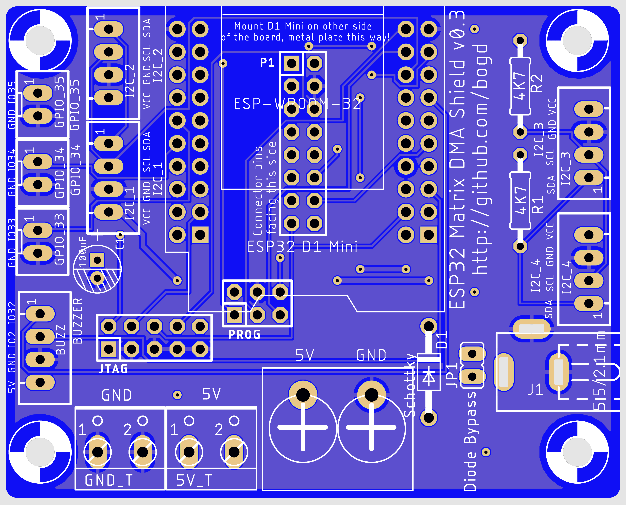

# ESP32 Morphing Clock Shield PCB

## Info

Features:
* 16-wire ribbon cable connection to the RGB matrix
* Mounting holes for securing the shield to the enclosure
* Options for both PTH and SMD (0805/SOD-323) parts for all parts
* Multiple JST-XH (2.54mm) connectors for I2C sensors and for GPIOs (use for push-buttons, for example)
* Exposed JTAG and PROG connectors, for use with debugging/programming via ESP32-Prog 

**WARNING!!** Do not use v0.1 of the boards! I have made several mistakes while designing them (reversed OE/LAT pins on the matrix connector, and put in a WAY too thin power supply trace). As a result, I was unable to get the ESP32 to even boot when connected to these boards.

v0.3 has been tested, and works reliably.

## Board 

TODO - still waiting for the finished boards...

In the meantime, this is the image generated from the gerbers:

## Schematic

